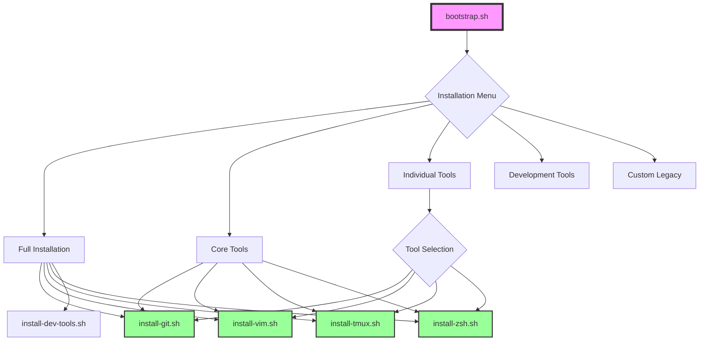

# Atomic Installer System

## Overview

The dotfiles repository now features a modular, atomic installer system where each tool has its own standalone, idempotent installation script. This follows the Unix philosophy of "do one thing and do it well" and Python's Zen principle of "simple is better than complex."

## Architecture



## Installation Methods

### Quick Start

```bash
# Clone the repository
git clone https://github.com/yourusername/.dotfiles.git ~/work/.dotfiles
cd ~/work/.dotfiles

# Make scripts executable
chmod +x bootstrap.sh scripts/*.sh

# Run the bootstrap script
./bootstrap.sh
```

### Installation Options

#### 1. Full Installation (Recommended)
Installs all core tools and development environment.

```bash
./bootstrap.sh
# Select option 1
```

**What gets installed:**
- Git with configuration
- Vim and Neovim
- Tmux with TPM
- Zsh with Oh My Zsh
- Development tools (if available)

#### 2. Core Tools Only
Installs essential tools without development extras.

```bash
./bootstrap.sh
# Select option 2
```

**What gets installed:**
- Git
- Vim and Neovim
- Tmux
- Zsh (without changing default shell)

#### 3. Individual Tool Installation
Install specific tools one at a time.

```bash
./bootstrap.sh
# Select option 3
# Then choose individual tools
```

### Direct Tool Installation

You can also run individual installers directly:

```bash
# Install Git
./scripts/install-git.sh

# Install Vim/Neovim
./scripts/install-vim.sh

# Install Tmux
./scripts/install-tmux.sh

# Install Zsh with Oh My Zsh
./scripts/install-zsh.sh
```

## Atomic Installer Scripts

### Features

Each installer script is:

- **Idempotent**: Can be run multiple times safely
- **Atomic**: Focuses on installing one tool
- **Cross-platform**: Works on Linux and macOS
- **Self-contained**: No complex dependencies
- **Interactive**: Prompts for optional features

### Script Structure

```
scripts/
├── install-git.sh      # Git installation and configuration
├── install-vim.sh      # Vim/Neovim installation
├── install-tmux.sh     # Tmux with TPM
└── install-zsh.sh      # Zsh with Oh My Zsh and plugins
```

## Individual Tool Documentation

### Git Installer (`install-git.sh`)

**Features:**
- Installs Git via package manager
- Links gitconfig from dotfiles
- Sets up global gitignore
- Configures sensible defaults
- Optional GitHub CLI installation

**Usage:**
```bash
./scripts/install-git.sh
```

**Configuration:**
- Prompts for user name and email if not set
- Sets default branch to `main`
- Configures pull, fetch, and rebase settings

### Vim/Neovim Installer (`install-vim.sh`)

**Features:**
- Choice of Vim, Neovim, or both
- Links existing config or creates minimal one
- Cross-platform installation

**Usage:**
```bash
./scripts/install-vim.sh
# Then select:
# 1) vim only
# 2) neovim only  
# 3) both vim and neovim
```

**Configuration:**
- Links `.vimrc` if exists in repository
- Creates `.config/nvim/init.vim` for Neovim
- Provides minimal config if none exists

### Tmux Installer (`install-tmux.sh`)

**Features:**
- Installs tmux via package manager
- Links tmux configuration
- Installs TPM (Tmux Plugin Manager)

**Usage:**
```bash
./scripts/install-tmux.sh
```

**Configuration:**
- Links `.tmux.conf` from repository
- Sets up TPM in `~/.tmux/plugins/tpm`
- Ready for plugin installation

### Zsh Installer (`install-zsh.sh`)

**Features:**
- Installs Zsh
- Installs Oh My Zsh framework
- Sets up popular plugins:
  - zsh-autosuggestions
  - zsh-syntax-highlighting
  - powerlevel10k theme
- Optional: Set as default shell

**Usage:**
```bash
./scripts/install-zsh.sh
# Prompts to set as default shell
```

**Configuration:**
- Links `.zshrc` from repository
- Installs plugins to `$ZSH_CUSTOM`
- Backs up existing `.zshrc` if present

## Platform Support

### Linux
- **Ubuntu/Debian**: Full support via apt
- **Arch/Manjaro**: Full support via pacman
- **Fedora/RHEL**: Full support via dnf
- **Other**: Fallback methods available

### macOS
- **Homebrew**: Required for most installations
- **Xcode CLT**: Automatically installed if needed

### Windows
- **WSL**: Detected and supported
- **Native**: Not supported

## Design Principles

### 1. Simplicity
Each script does one thing well. No complex logic or multiple responsibilities.

### 2. Idempotency
Scripts check if software is already installed and configured. Running multiple times is safe.

### 3. Independence
Each installer can run standalone without depending on others.

### 4. User Control
Scripts prompt for optional features rather than making assumptions.

### 5. Error Handling
Scripts use `set -euo pipefail` for proper error handling and exit on failures.

## Troubleshooting

### Permission Denied
```bash
# Make scripts executable
chmod +x bootstrap.sh scripts/*.sh
```

### Package Manager Not Found
Scripts automatically detect package managers. Supported:
- apt (Ubuntu/Debian)
- pacman (Arch)
- dnf (Fedora)
- brew (macOS)

### Existing Configurations
Scripts backup existing configs before linking new ones:
- Backups are timestamped
- Original configs preserved as `.backup.YYYYMMDD-HHMMSS`

### Missing Dependencies
- **macOS**: Install Homebrew first
- **Linux**: Ensure sudo access for package installation

## Advanced Usage

### Non-Interactive Installation

For automated setups, you can pipe responses:

```bash
# Install both vim and neovim
echo "3" | ./scripts/install-vim.sh

# Install zsh and set as default shell
echo "y" | ./scripts/install-zsh.sh

# Full installation with all defaults
./bootstrap.sh <<EOF
1
y
EOF
```

### Custom Configuration Paths

Scripts look for configs in order:
1. `$SCRIPT_DIR/<tool>/.<config>`
2. `$SCRIPT_DIR/configs/.<config>`
3. Creates minimal config if none found

### Environment Variables

Scripts respect:
- `$HOME` - User home directory
- `$SHELL` - Current shell
- `$ZSH_CUSTOM` - Oh My Zsh custom directory

## Contributing

When adding new installers:

1. Create script in `scripts/` directory
2. Follow naming convention: `install-<tool>.sh`
3. Include these sections:
   - Install function (check if exists first)
   - Configure function (link configs)
   - Main function (orchestrate)
4. Use consistent error handling
5. Make idempotent and atomic

### Template

```bash
#!/bin/bash
set -euo pipefail

SCRIPT_DIR="$(cd "$(dirname "${BASH_SOURCE[0]}")/.." && pwd)"

install_tool() {
    if command -v tool &> /dev/null; then
        echo "tool already installed"
        return 0
    fi
    # Installation logic
}

configure_tool() {
    # Configuration logic
}

main() {
    install_tool
    configure_tool
    echo "tool setup complete"
}

main "$@"
```

## License

See LICENSE file in repository root.